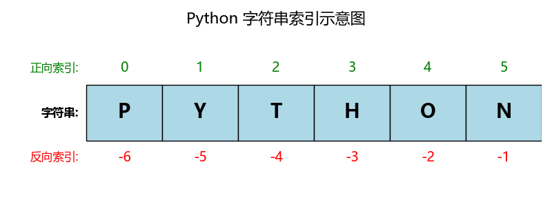
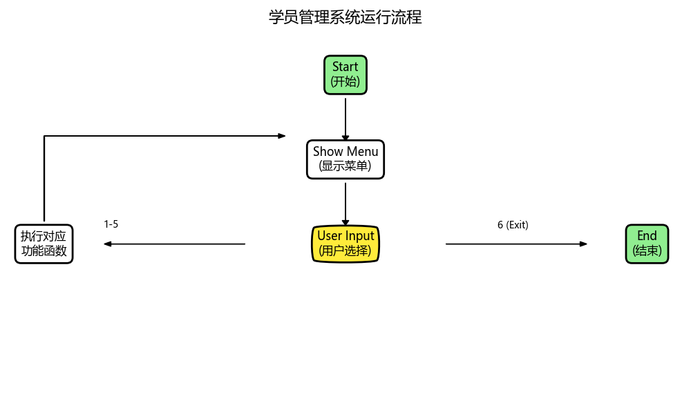
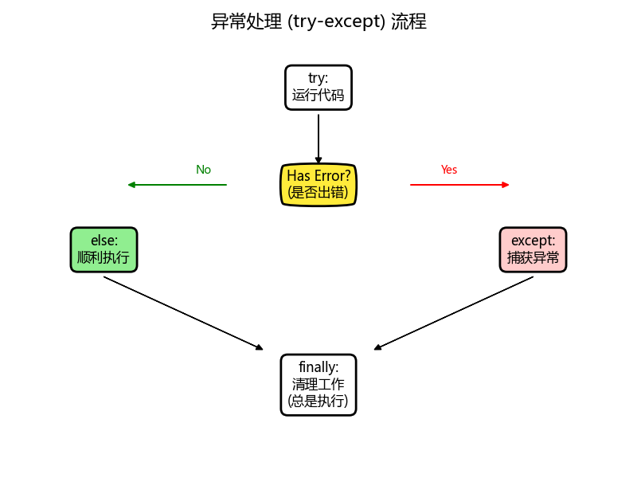

# 基础学习 (Base)

本目录存放 Python 基础学习代码，包括但不限于：

- 变量与数据类型
- 控制流 (if, for, while)
- 函数
- 模块与包
- 基础输入输出

## 学习笔记

### 1. 注释与输出

- **代码文件**: [01_comments_and_print.py](01_comments_and_print.py)
- **知识点**:
  - **单行注释**: 使用 `#` 开头。
  - **多行注释**: 使用三个引号 `'''` 或 `"""` 包裹。
  - **文档字符串 (Docstring)**: 函数或模块开头的多行字符串，用于说明功能。
  - **print() 函数**:
    - `sep`: 用于指定多个参数之间的分隔符（默认为空格）。
    - `end`: 用于指定输出结束后的字符（默认为换行符 `\n`）。
    - `file`: 指定输出流（默认为控制台）。
    - `flush`: 是否强制刷新缓冲区。

### 2. 变量与赋值

- **代码文件**: [02_variables_and_assignment.py](02_variables_and_assignment.py)
- **知识点**:
  - **变量定义**: Python 是动态类型语言，直接赋值即可创建变量。
  - **命名规则**: 只能包含字母、数字、下划线，不能以数字开头。推荐使用蛇形命名法 (`snake_case`)。
  - **赋值技巧**:
    - 多变量赋值: `x, y = 1, 2`
    - 链式赋值: `a = b = 0`
    - 变量交换: `a, b = b, a`
    - 解包赋值: `first, *rest = [1, 2, 3]`
  - **类型提示**: 使用 `name: str = "Alice"` 这种形式（Python 3.5+）。

### 3. 输入与运算符

- **代码文件**: [03_input_and_operators.py](03_input_and_operators.py)
- **知识点**:
  - **输入函数**:
    - `input(prompt)`: 接收用户输入，始终返回**字符串**。
    - 类型转换: 使用 `int()`, `float()` 等函数将字符串转换为数字。
  - **运算符**:
    - **算术**: `+`, `-`, `*`, `/` (浮点除), `//` (整除), `%` (取模), `**` (幂)。
    - **比较**: `==`, `!=`, `>`, `<`, `>=`, `<=` (返回布尔值)。
    - **逻辑**: `and`, `or`, `not` (支持短路求值)。
    - **赋值**: `=`, `+=`, `-=`, `*=`, `/=` 等。
    - **成员**: `in`, `not in` (检查元素是否存在于容器中)。
    - **身份**: `is`, `is not` (比较对象内存地址)。

### 4. 字符串详解

- **代码文件**: [04_strings.py](04_strings.py)

#### 4.1 核心概念

- **不可变性**: 字符串一旦创建，就不能在原位修改（修改通常会产生新字符串）。
- **索引与切片**:
  - **索引**: 访问单个字符（如 `s[0]`）。
  - **切片**: 提取子串（如 `s[1:5]`, `s[::-1]` 反转）。



#### 4.2 常用操作与方法

| 分类       | 方法/操作                   | 说明                               |
| :--------- | :-------------------------- | :--------------------------------- |
| **基础**   | `+`, `*`, `in`              | 拼接、重复、检查子串是否存在       |
| **格式化** | `f"{var}"`                  | **推荐**。f-string 格式化          |
| **去空白** | `strip()`, `lstrip()`       | 去除两端或单侧的空白字符           |
| **大小写** | `upper()`, `lower()`        | 转换全大写或全小写                 |
| **查找**   | `find()`, `count()`         | 查找索引（未找到返回-1）、统计次数 |
| **替换**   | `replace(old, new)`         | 替换子串                           |
| **拆分**   | `split(sep)`                | 按分隔符拆分为列表                 |
| **连接**   | `sep.join(list)`            | 将列表元素连接为字符串             |
| **判断**   | `isdigit()`, `startswith()` | 判断是否全数字、是否以某子串开头等 |

#### 4.3 编码与解码 (Encoding/Decoding)

计算机底层只能存储字节 (bytes)，而我们在屏幕上看到的是字符 (str)。

- **str $\rightarrow$ bytes**: 使用 **`encode()`** (编码)
  - `s.encode("utf-8")`: 转为 UTF-8 字节（通用）。
  - `s.encode("gbk")`: 转为 GBK 字节（中文常用）。
- **bytes $\rightarrow$ str**: 使用 **`decode()`** (解码)
  - `b.decode("utf-8")`: 将字节还原为字符串。

> **注意**: 编码和解码必须使用**相同**的格式（如都用 utf-8），否则会出现乱码或报错。

### 5. 列表详解

- **代码文件**: [05_lists.py](05_lists.py)

#### 5.1 核心特性

- **有序**: 元素有固定的顺序，可以通过索引访问。
- **可变 (Mutable)**: **这是列表与字符串最大的区别**。可以直接修改列表中的元素，而不需要创建新列表。
- **混合类型**: 一个列表可以包含不同类型的元素（如 `[1, "Hello", True]`）。

#### 5.2 常用内建方法 (增删改查)

| 分类     | 函数                 | 作用                                        |
| :------- | :------------------- | :------------------------------------------ |
| **增加** | `append(元素)`       | 在列表**末尾**添加一个元素                  |
|          | `insert(索引, 元素)` | 在**指定位置**插入一个元素                  |
|          | `extend(列表)`       | 将另一个列表的所有元素追加到末尾            |
| **删除** | `pop(索引)`          | 移除并**返回**指定位置的元素 (默认最后一个) |
|          | `remove(元素)`       | 移除**第一个**匹配的元素 (不存在则报错)     |
|          | `clear()`            | 清空列表所有元素                            |
| **查找** | `index(元素)`        | 找元素第一次出现的索引 (没找到报错)         |
|          | `count(元素)`        | 统计元素出现的次数 (没找到返回 0)           |
| **排序** | `sort()`             | 原地排序 (默认升序, `reverse=True` 降序)    |
|          | `reverse()`          | 原地反转列表                                |
| **复制** | `copy()`             | 创建列表的浅拷贝                            |

#### 5.3 常用操作

- **嵌套列表**: `matrix = [[1, 2], [3, 4]]`，通过 `matrix[0][1]` 访问。
- **切片赋值**: `lst[1:3] = ["a", "b"]` 可以批量修改元素。
- **列表推导式 (入门)**: `[x**2 for x in range(5)]` 快速生成列表 `[0, 1, 4, 9, 16]`。

### 6. 元组详解 (Tuple)

- **代码文件**: [06_tuples.py](06_tuples.py)
- **知识点**:

#### 6.1 列表 vs 元组 (List vs Tuple)

| 特性          | 列表 (List)            | 元组 (Tuple)                              |
| :------------ | :--------------------- | :---------------------------------------- |
| **符号**      | 方括号 `[]`            | 圆括号 `()`                               |
| **可变性**    | **可变** (Mutable)     | **不可变** (Immutable)                    |
| **修改元素**  | 允许 (`lst[0] = 1`)    | **报错** (`TypeError`)                    |
| **增加/删除** | 允许 (`append`, `pop`) | **不允许**                                |
| **速度**      | 相对较慢               | 相对较快 (内存占用更小)                   |
| **用途**      | 存储需要经常变化的数据 | 存储固定的数据 (如坐标、配置、数据库记录) |
| **字典键**    | **不能**作为字典的键   | **可以**作为字典的键 (如果是不可变)       |

#### 6.2 常用操作

- **定义**:
  - 空元组: `()`
  - 单元素元组: `(1,)` **(注意必须加逗号)**
  - 省略括号: `t = 1, 2, 3` (Packing)
- **解包 (Unpacking)**: `x, y = (10, 20)` 快速赋值。
- **不可变性**: 一旦定义，无法修改。但如果元组包含可变对象（如列表），该列表的内容是可以修改的。

### 7. 字典详解 (Dictionary)

- **代码文件**: [07_dictionaries.py](07_dictionaries.py)

#### 7.1 核心特性

- **键值对 (Key-Value)**: 数据以 `key: value` 的形式存储。
- **键 (Key) 的要求**: 必须是**唯一**的，且是**不可变**的（如字符串、数字、元组）。
- **可变 (Mutable)**: 可以随时修改值、增加或删除键值对。

#### 7.2 常用方法

| 分类          | 方法                 | 作用                                            |
| :------------ | :------------------- | :---------------------------------------------- |
| **访问**      | `d[key]`             | 获取值 (键不存在报错)                           |
|               | `get(key, default)`  | **推荐**。获取值 (键不存在返回 None 或默认值)   |
| **增加/修改** | `d[key] = value`     | 如果键存在则修改，不存在则新增                  |
|               | `update(other_dict)` | 批量更新键值对                                  |
| **删除**      | `pop(key)`           | 删除指定键并返回对应的值                        |
|               | `popitem()`          | 删除并返回最后一个插入的键值对                  |
|               | `del d[key]`         | 删除指定键                                      |
|               | `clear()`            | 清空字典                                        |
| **遍历**      | `keys()`             | 获取所有键                                      |
|               | `values()`           | 获取所有值                                      |
|               | `items()`            | 获取所有键值对 (常用于 `for k, v in d.items()`) |

### 8. 集合详解 (Set)

- **代码文件**: [08_sets.py](08_sets.py)

#### 8.1 核心特性

- **无序性**: 集合中的元素没有固定顺序，不支持索引访问。
- **唯一性**: 自动过滤重复元素，常用于去重。
- **可变性**: 可以添加或删除元素，但集合内的元素必须是不可变类型（如数字、字符串、元组）。

#### 8.2 常用方法与运算

| 分类     | 操作/方法            | 作用                                |
| :------- | :------------------- | :---------------------------------- | -------------------------------- |
| **基础** | `add(x)`             | 添加单个元素                        |
|          | `update(iterable)`   | 合并其他集合、列表等                |
|          | `remove(x)`          | 删除元素 (不存在会报错)             |
|          | `discard(x)`         | **推荐**。删除元素 (不存在不报错)   |
|          | `pop()`              | 随机删除并返回一个元素              |
| **运算** | `a                   | b`/`union`                          | **并集**: 包含 a 和 b 的所有元素 |
|          | `a & b` / `inter...` | **交集**: a 和 b 共同拥有的元素     |
|          | `a - b` / `diff...`  | **差集**: 在 a 中但不在 b 中的元素  |
|          | `a ^ b` / `symm...`  | **对称差集**: a 或 b 中不同时存在的 |
| **关系** | `issubset()`         | 是否为子集                          |
|          | `isdisjoint()`       | 是否没有交集                        |

#### 8.3 不可变集合 (frozenset)

- **定义**: `fs = frozenset([1, 2, 3])`
- **特点**: 一旦创建不可修改。
- **用途**: 可以作为字典的键 (Key) 或另一个集合的元素。

### 9. 数据类型总结 (Data Types Summary)

- **代码文件**: [09_data_types_summary.py](09_data_types_summary.py)

#### 9.1 基本数据类型

| 数据类型               | 通俗理解               | 核心特点                                |
| :--------------------- | :--------------------- | :-------------------------------------- |
| **整型** (`int`)       | 整数 (正/负/零)        | 可计算，无小数点                        |
| **浮点型** (`float`)   | 小数                   | 可计算，有小数点                        |
| **布尔型** (`bool`)    | 真 / 假判断            | 只有 `True` (真) 和 `False` (假) 两个值 |
| **复数型** (`complex`) | 数学复数 (实部 + 虚部) | 虚部带 `j`，数学场景用                  |
| **字符串** (`str`)     | 文字容器               | 不可修改，支持索引 / 切片               |
| **空值** (`None`)      | 无数据标记             | 表示“没有内容”，单独类型                |

#### 9.2 复合数据结构

| 数据类型           | 通俗理解             | 核心特点                                    |
| :----------------- | :------------------- | :------------------------------------------ |
| **列表** (`list`)  | 可修改的有序数据筐   | **有序**、**可增删改**、元素可重复          |
| **元组** (`tuple`) | 不可修改的有序数据筐 | **有序**、**不可修改**、元素可重复          |
| **字典** (`dict`)  | 带标签的数据柜子     | **键值对**、**键唯一**、无序(3.7+插入有序)  |
| **集合** (`set`)   | 自动去重的袋子       | **无序**、**元素唯一**、快速去重/交并补运算 |

#### 9.3 公共操作 (Common Operations)

| 方法/函数     | 作用               | 示例                          |
| :------------ | :----------------- | :---------------------------- |
| `len(obj)`    | 获取容器内元素个数 | `len([1,2])` -> 2             |
| `type(obj)`   | 查看数据类型       | `type(10)` -> `<class 'int'>` |
| `id(obj)`     | 查看对象内存地址   | `id(x)` -> 1407...            |
| `del obj`     | 删除变量或元素     | `del x[0]`                    |
| `max(seq)`    | 返回序列最大值     | `max([1, 5])` -> 5            |
| `min(seq)`    | 返回序列最小值     | `min([1, 5])` -> 1            |
| `sum(seq)`    | 返回序列总和       | `sum([1, 2])` -> 3            |
| `sorted(seq)` | 排序并返回新列表   | `sorted([3,1])` -> `[1, 3]`   |

#### 9.4 类型转换 (Type Conversion)

当需要用一种类型的方法处理另一种类型数据时，用以下函数转换（核心原则：**能转则转，不能转则报错**）。

| 转换函数     | 作用                               | 示例                                         |
| :----------- | :--------------------------------- | :------------------------------------------- |
| `int(x)`     | 转为整数                           | `int("10")` -> 10, `int(3.14)` -> 3          |
| `float(x)`   | 转为小数                           | `float(10)` -> 10.0, `float("3.14")` -> 3.14 |
| `bool(x)`    | 转为布尔值                         | `bool(0)` -> False, `bool("a")` -> True      |
| `str(x)`     | 转为字符串                         | `str(10)` -> "10", `str([1,2])` -> "[1, 2]"  |
| `eval(str)`  | 执行字符串表达式，并返回表达式的值 | `eval("1+1")` -> 2                           |
| `list(seq)`  | 转为列表                           | `list((1,2))` -> `[1, 2]`                    |
| `tuple(seq)` | 转为元组                           | `tuple([1,2])` -> `(1, 2)`                   |
| `set(seq)`   | 转为集合 (自动去重)                | `set([1,2,1])` -> `{1, 2}`                   |
| `dict(seq)`  | 转为字典 (需要键值对序列)          | `dict([('a',1)])` -> `{'a': 1}`              |

### 10. 条件语句 (Conditional Statements)

- **代码文件**: [10_conditionals.py](10_conditionals.py)

#### 10.1 核心语法

Python 使用 `if`, `elif`, `else` 关键字进行条件判断。**缩进 (Indentation)** 在 Python 中至关重要，它决定了代码块的归属。

```python
if condition1:
    # 当 condition1 为真时执行
    statement_block_1
elif condition2:
    # 当 condition1 为假 且 condition2 为真时执行
    statement_block_2
else:
    # 当以上所有条件都为假时执行
    statement_block_3
```

#### 10.2 逻辑运算符

| 运算符 | 描述                                  | 示例                           |
| :----- | :------------------------------------ | :----------------------------- |
| `and`  | **与**：所有条件都为真才返回 True     | `if age > 18 and has_ticket:`  |
| `or`   | **或**：只要有一个条件为真就返回 True | `if is_weekend or is_holiday:` |
| `not`  | **非**：取反，真变假，假变真          | `if not is_valid:`             |

#### 10.3 真值测试 (Truth Value Testing)

在 `if` 判断中，不仅仅是 `True`/`False`，很多值会被隐式转换为布尔值。

| 被视为 False 的值                  | 被视为 True 的值                 |
| :--------------------------------- | :------------------------------- |
| `False`, `None`                    | `True`                           |
| `0`, `0.0` (零)                    | 非零数值 (如 `1`, `-5`, `3.14`)  |
| `""`, `''` (空字符串)              | 非空字符串 (如 `"hello"`, `" "`) |
| `[]`, `()`, `{}`, `set()` (空容器) | 非空容器 (如 `[0]`, `{'a': 1}`)  |

#### 10.4 三元运算符 (Ternary Operator)

Python 提供了一种简洁的一行 `if-else` 写法，常用于赋值。

- **语法**: `value_if_true if condition else value_if_false`
- **示例**: `status = "Adult" if age >= 18 else "Minor"`

#### 10.5 注意事项 (Best Practices)

1.  **缩进**: 务必保持一致（推荐使用 4 个空格）。混合使用 Tab 和空格会导致 `IndentationError`。
2.  **pass 语句**: 如果 `if` 语句块中暂时不想写代码，必须写 `pass` 占位，否则会报错。
3.  **尽量减少嵌套**: 过深的嵌套 (`if` 里面套 `if`) 会导致代码难以阅读。尝试使用 `elif` 或提前返回 (`return`) 来优化。

### 11. 循环语句 (Loops)

- **代码文件**: [11_loops.py](11_loops.py)

#### 11.1 for 循环 (for Loop)

`for` 循环用于遍历序列（如列表、元组、字符串）或通过 `range()` 生成的数字序列。

```python
for item in sequence:
    # 对 sequence 中的每个元素 item 执行代码
    print(item)
```

#### 11.2 range() 函数

用于生成一系列数字，常与 `for` 循环配合使用。

| 用法                       | 描述                          | 示例 (`list(range(...))`)              |
| :------------------------- | :---------------------------- | :------------------------------------- |
| `range(stop)`              | 从 0 开始，到 stop-1 结束     | `range(5)` -> `[0, 1, 2, 3, 4]`        |
| `range(start, stop)`       | 从 start 开始，到 stop-1 结束 | `range(2, 5)` -> `[2, 3, 4]`           |
| `range(start, stop, step)` | 按 step (步长) 递增           | `range(0, 10, 2)` -> `[0, 2, 4, 6, 8]` |

#### 11.3 while 循环 (while Loop)

`while` 循环会在条件为 `True` 时持续执行代码块。**务必小心死循环**（条件永远为真，程序无法停止）。

```python
while condition:
    # 只要 condition 为真，就一直执行
    do_something()
    update_condition() # 别忘了更新条件！
```

#### 11.4 循环控制 (Loop Control)

| 关键字     | 作用                         | 场景                                        |
| :--------- | :--------------------------- | :------------------------------------------ |
| `break`    | **立即终止**整个循环         | 找到了想要的结果，提前结束                  |
| `continue` | **跳过本次**，进入下一次循环 | 当前数据不需要处理，直接看下一个            |
| `else`     | **循环正常结束**后执行       | 如果循环被 `break` 打断，则不执行 `else` 块 |

### 12. 函数 (Functions)

- **代码文件**: [12_functions.py](12_functions.py)

#### 12.1 核心概念

函数是组织好的、可重复使用的代码块。你可以把它想象成一个黑盒子：你给它输入（参数），它给你输出（返回值）。


- **定义**: 使用 `def` 关键字。
- **调用**: 使用函数名加括号 `func_name()`。
- **文档字符串**: 函数定义下的第一行字符串，用于说明函数功能。

```python
# 定义函数
def say_hello():
    """这是一个简单的问候函数"""
    print("Hello, Python!")

# 调用函数
say_hello()
```

#### 12.2 参数与返回值

| 类型           | 描述                              | 示例               |
| :------------- | :-------------------------------- | :----------------- |
| **位置参数**   | 最常见的参数，必须按顺序传        | `func(1, 2)`       |
| **关键字参数** | 指定参数名，顺序不重要            | `func(b=2, a=1)`   |
| **默认参数**   | 如果不传则使用默认值              | `def func(a=1):`   |
| **可变参数**   | `*args` (元组), `**kwargs` (字典) | `def func(*args):` |
| **返回值**     | 使用 `return` 返回结果            | `return result`    |

**示例代码：**

```python
# 1. 基础参数与返回值
def add(a, b):
    return a + b

result = add(3, 5)  # result = 8

# 2. 默认参数
def greet(name, msg="你好"):
    print(f"{msg}, {name}")

greet("Alice")          # 输出: 你好, Alice
greet("Bob", "Hello")   # 输出: Hello, Bob

# 3. 可变参数 (*args) - 接收任意数量的位置参数
def sum_all(*numbers):
    total = 0
    for num in numbers:
        total += num
    return total

print(sum_all(1, 2, 3))  # 输出: 6
```

#### 12.3 返回值详解 (Return Values)

`return` 语句用于退出函数并返回结果。

- **隐式返回 None**: 如果函数没有 `return` 语句，或者 `return` 后面什么都不写，它默认返回 `None`。
- **提前结束 (Early Return)**: 一旦执行到 `return`，函数**立即停止**，后面的代码**不会执行**。

```python
# 1. 没有 return 的函数
def no_return():
    print("Doing something...")

result = no_return()
print(result)  # 输出: None

# 2. return 提前结束
def check_positive(number):
    if number <= 0:
        return "无效数字"  # 遇到 return 立即结束

    print("正在计算...")   # 只有 number > 0 才会执行到这里
    return number * 2

print(check_positive(-5)) # 输出: 无效数字 (print不会执行)
print(check_positive(10)) # 输出: 正在计算... 20
```

#### 12.4 变量作用域 (Scope)

- **全局变量 (Global)**: 在函数外部定义，所有地方都能读。
- **局部变量 (Local)**: 在函数内部定义，只有函数内部能用。
- **注意**: 在函数内修改全局变量需要使用 `global` 关键字。

```python
x = 100  # 全局变量

def func():
    y = 10   # 局部变量
    print(x) # 可以读取全局变量
    # print(y) # 正常

func()
# print(y) # 报错！y 在函数外不存在
```

### 13. 实战：学员管理系统 (Student Management System)

- **代码文件**: [13_student_management_system.py](13_student_management_system.py)

#### 13.1 项目简介

这是一个基础友好的实战项目 —— 用 **函数 + 循环 + 字典/列表**，打造能实现“添加、删除、修改、查询、显示所有、退出”的学员管理系统。全程拆解每一步逻辑，代码带详细注释，跟着做就能掌握函数调用、数据存储、循环控制的核心用法，还能直接复用成品系统！

#### 13.2 系统流程图



#### 13.3 功能清单

1.  **添加学员**: 自动生成唯一的 4 位学号，录入姓名和手机号。
2.  **删除学员**: 根据学号查找并删除，带二次确认。
3.  **编辑学员**: 修改姓名或手机号，支持回车跳过不修改。
4.  **查询学员**: 根据学号精确查询。
5.  **显示所有**: 以表格形式列出所有学员信息。
6.  **退出系统**: 安全退出循环。

#### 13.4 核心代码逻辑 (Core Logic)

```python
# 数据结构设计：使用列表存储字典
students = [
    {'id': '1001', 'name': '张三', 'phone': '138...'},
    {'id': '1002', 'name': '李四', 'phone': '139...'}
]

# 主循环逻辑
def main():
    while True:
        print_menu()
        choice = input("请选择: ")
        if choice == '1':
            add_student()
        # ... 其他功能 ...
        elif choice == '6':
            break
```

### 14. 异常处理 (Exception Handling)

- **代码文件**: [14_exceptions.py](14_exceptions.py)

#### 14.1 什么是异常？

异常 (Exception) 是程序运行过程中发生的错误。如果不处理，程序会直接崩溃。使用 `try-except` 结构可以让我们优雅地处理这些错误，防止程序闪退。

#### 14.2 处理流程图



#### 14.3 核心关键字

| 关键字      | 说明                                  | 示例场景                                 |
| :---------- | :------------------------------------ | :--------------------------------------- |
| **try**     | 尝试运行可能出错的代码                | `result = 10 / 0`                        |
| **except**  | 捕获特定类型的错误并处理              | 捕获 `ZeroDivisionError` 提示“不能除以0” |
| **else**    | 如果 `try` 块**没有**出错，则执行此块 | 打印计算成功的结果                       |
| **finally** | **无论是否出错**，最后一定会执行      | 关闭文件、断开数据库连接                 |
| **raise**   | 主动抛出一个异常                      | 年龄输入负数时，主动报错                 |

#### 14.4 常见代码结构

```python
try:
    # 可能出错的代码
    f = open('data.txt', 'r')
    content = f.read()
except FileNotFoundError:
    # 发生特定错误时执行
    print("文件没找到！")
except Exception as e:
    # 发生其他未知错误时执行
    print(f"未知错误: {e}")
else:
    # 没出错时执行
    print("读取成功")
finally:
    # 总是执行
    if 'f' in locals():
        f.close()
    print("操作结束")
```

### 15. 模块 (Modules)

- **代码文件**: [15_modules.py](15_modules.py)
- **辅助模块**: [my_utils.py](my_utils.py)

#### 15.1 什么是模块？

模块 (Module) 就是一个 `.py` 文件。我们可以导入 (import) 别人写好的模块（标准库），也可以导入自己写的模块。使用模块可以极大地提高代码的复用性。

#### 15.2 模块分类

| 类型           | 说明                                | 示例                           |
| :------------- | :---------------------------------- | :----------------------------- |
| **内置模块**   | Python 安装自带，无需安装，直接导入 | `math`, `random`, `os`, `time` |
| **第三方模块** | 社区开发，需要用 `pip install` 安装 | `requests`, `pandas`, `numpy`  |
| **自定义模块** | 我们自己编写的 `.py` 文件           | `my_utils.py`                  |

#### 15.3 导入关系示意图


#### 15.4 导入方式详解

1.  **直接导入 (import ...)**
    - **适用**: 导入整个模块，使用时必须带前缀。

    ```python
    import math
    print(math.sqrt(16))  # 必须写 math.
    ```

2.  **导入特定功能 (from ... import ...)**
    - **适用**: 只想用模块里的某几个函数，不想写前缀。

    ```python
    from random import randint
    print(randint(1, 10)) # 不需要写 random.
    ```

3.  **起别名 (import ... as ...)**
    - **适用**: 模块名太长，或者跟现有变量名冲突。

    ```python
    import datetime as dt
    print(dt.datetime.now())
    ```

4.  **导入所有 (from ... import \*) - ⚠️ 慎用**
    - **风险**: 会把模块里所有东西都倒进来，容易覆盖掉你自己定义的变量。
    ```python
    from math import *
    # 如果你也定义了一个 sqrt 函数，就会冲突！
    ```

#### 15.5 避坑指南 (Pitfalls)

> ⚠️ **千万不要给自己写的文件起名为 `math.py`, `random.py`, `socket.py` 等！**

如果你创建了一个 `random.py`，当你写 `import random` 时，Python 会优先导入**你的**文件，而不是系统的标准库，这会导致各种莫名其妙的报错（比如 `AttributeError: module 'random' has no attribute 'randint'`）。

#### 15.6 `if __name__ == "__main__":` 的作用

这是一个非常经典的 Python 面试题，也是写模块时的必知技巧。

- **直接运行**文件时：`__name__` 的值是 `"__main__"`。
- **被导入**时：`__name__` 的值是模块的名字（如 `"my_utils"`）。

所以，放在 `if __name__ == "__main__":` 下面的代码，只有在**直接运行该文件**时才会执行，**被导入时不会执行**（通常用于测试）。

### 16. 包 (Packages)

- **代码文件**: [16_packages.py](16_packages.py)
- **包目录**: [my_package](my_package/)

#### 16.1 什么是包？

包 (Package) 本质上就是一个包含 `__init__.py` 文件的**文件夹**。它用于将多个相关的模块组织在一起，形成一个层级结构。

**结构示例**:

```text
my_package/              <-- 这是一个包
    ├── __init__.py      <-- 必须有！(Python 3.3+ 虽不强制但推荐保留)
    ├── math_tools.py    <-- 子模块 1
    └── str_tools.py     <-- 子模块 2
```

#### 16.2 包结构示意图


#### 16.3 `__init__.py` 的作用

它是包的**入口**和**配置中心**。

| 作用         | 说明                                                  | 代码示例                      |
| :----------- | :---------------------------------------------------- | :---------------------------- |
| **标识**     | 告诉 Python 这个文件夹是一个包                        | (空文件即可)                  |
| **初始化**   | 导入包时会自动运行的代码                              | `print("Package loading...")` |
| **简化导入** | 暴露内部模块的功能，方便用户调用                      | `from .math_tools import add` |
| **暴露模块** | 将子模块暴露给包，让用户可以用 `pkg.mod` 调用         | `from . import calc`          |
| **控制导出** | `__all__` 列表控制 `from package import *` 导入的内容 | `__all__ = ['add', 'calc']`   |

#### 16.4 常见导入方式

假设我们想用 `my_package` 里的 `add` 函数（在 `math_tools.py` 中），或者 `calc` 模块：

1.  **路径导入 (最长)**:

    ```python
    import my_package.math_tools
    my_package.math_tools.add(1, 2)
    ```

2.  **模块导入 (常用)**:

    ```python
    from my_package import math_tools
    math_tools.add(1, 2)
    ```

3.  **函数导入 (最简)**:

    ```python
    from my_package.math_tools import add
    add(1, 2)
    ```

4.  **利用 `__init__.py` (高级)**:
    - **导入函数**: 如果 `__init__.py` 写了 `from .math_tools import add`
      ```python
      from my_package import add
      add(1, 2)
      ```
    - **导入模块**: 如果 `__init__.py` 写了 `from . import calc`
      ```python
      import my_package
      # 此时 my_package.calc 已经被自动挂载了
      my_package.calc.multiply(3, 4)
      ```

## 示例

- [hello.py](hello.py): 环境测试脚本
